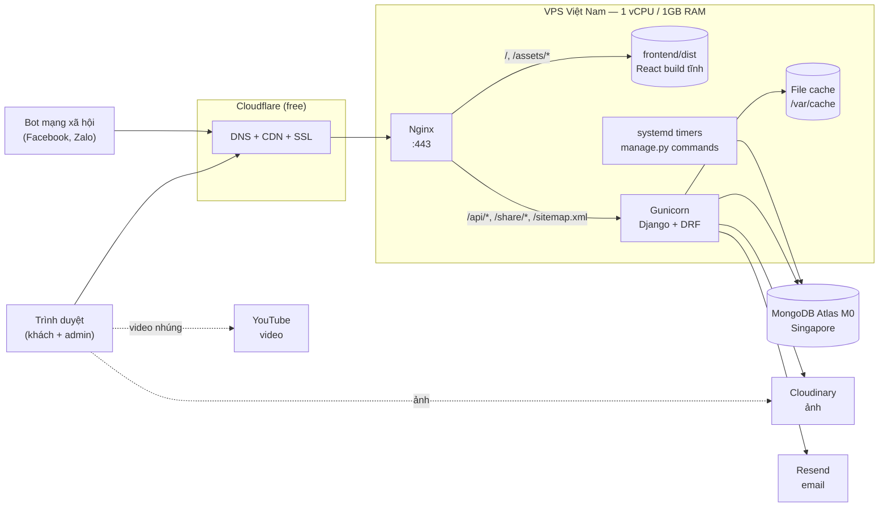
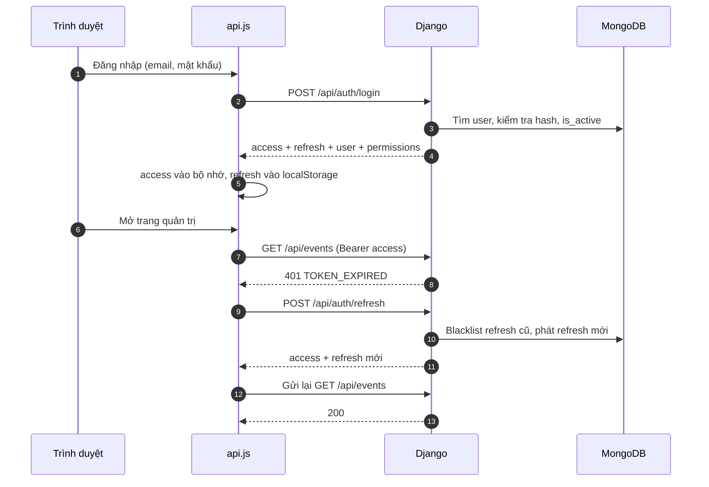
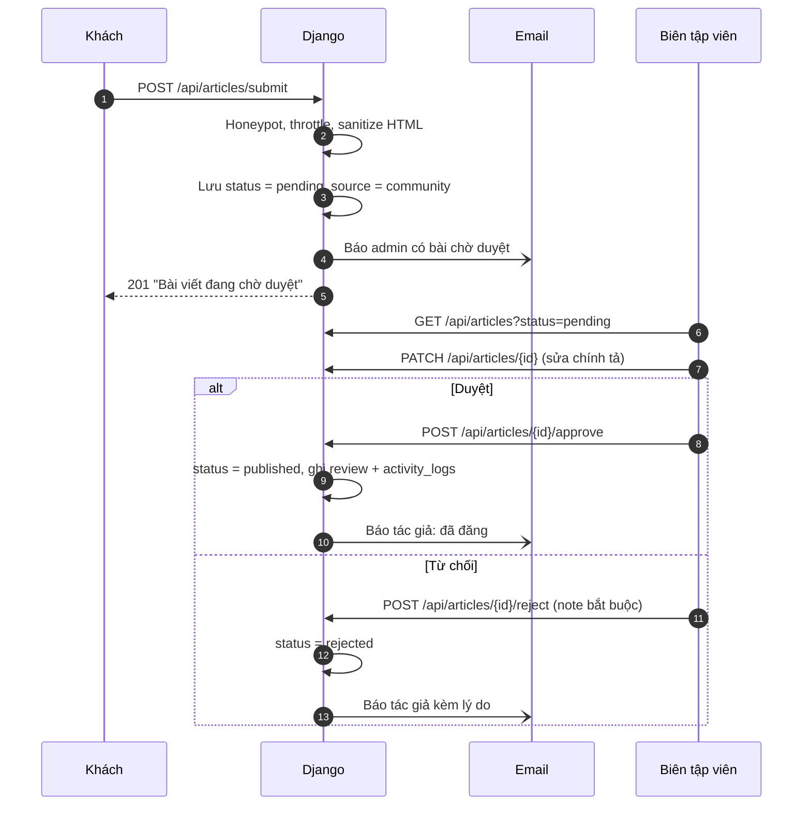

# Kiến trúc hệ thống — Nụ Cười Em

Tài liệu mô tả kiến trúc tổng thể, cách các thành phần giao tiếp, và các quyết
định kỹ thuật quan trọng của `nu-cuoi-em-web`.

| Tài liệu | Nội dung |
|----------|----------|
| [`DATABASE_SCHEMA.md`](DATABASE_SCHEMA.md) | Cấu trúc dữ liệu |
| [`API.md`](API.md) | Hợp đồng REST API |
| [`SETUP.md`](SETUP.md) | Dựng môi trường dev |
| [`DEPLOYMENT.md`](DEPLOYMENT.md) | Triển khai production |
| [`../project/Cau-truc-Repository.md`](../project/Cau-truc-Repository.md) | Vai trò từng thư mục/file |

---

## 1. Bối cảnh & ràng buộc

Kiến trúc được thiết kế xoay quanh bốn ràng buộc thực tế của dự án:

| Ràng buộc | Hệ quả kiến trúc |
|-----------|------------------|
| **Ngân sách ≤ 100.000đ/tháng** | Một VPS duy nhất (1 vCPU / 1GB RAM), mọi dịch vụ ngoài dùng free tier. Không Redis, không Celery, không staging riêng |
| **Đội ngũ tình nguyện, ít người** | Stack quen thuộc, ít thành phần chuyển động, triển khai tự động bằng một lệnh merge |
| **Lưu lượng thấp, có đỉnh theo sự kiện** | Vài nghìn đến vài chục nghìn lượt xem/tháng. Tối ưu cho chi phí và độ đơn giản, không tối ưu cho tải lớn |
| **Người quản trị không biết lập trình** | Toàn bộ nội dung sửa qua trang quản trị (WYSIWYG), không cần đụng code để đăng bài hay đổi thông tin |

Mục tiêu chất lượng theo thứ tự ưu tiên: **chi phí → dễ bảo trì → bảo mật dữ
liệu cá nhân → hiệu năng → tính sẵn sàng**.

---

## 2. Sơ đồ tổng thể



**Luồng một request thông thường:**

1. Trình duyệt tải `index.html` + bundle JS/CSS từ Nginx (Cloudflare cache
   `/assets/*` vì tên file có hash).
2. React khởi động, gọi `GET /api/settings/public` để lấy logo, thông tin liên
   hệ, số liệu tác động.
3. Mỗi trang gọi API tương ứng; Nginx proxy `/api/*` sang Gunicorn qua unix socket.
4. Django đọc/ghi MongoDB Atlas, trả JSON.
5. Ảnh tải thẳng từ CDN của Cloudinary, không đi qua VPS.

---

## 3. Công nghệ

| Lớp | Công nghệ | Vai trò |
|-----|-----------|---------|
| Frontend | React 18 + Vite | SPA, build thành file tĩnh |
| Routing | React Router | Định tuyến phía client |
| Styling | Tailwind CSS | Utility-first, responsive |
| Soạn thảo | WYSIWYG (§5.5) | Admin viết bài không cần HTML |
| Backend | Django 5.2 + Django REST Framework | API, xác thực, phân quyền, Django Admin |
| ORM | `django-mongodb-backend` | Model Django trên MongoDB |
| Database | MongoDB Atlas M0 | Dữ liệu nghiệp vụ |
| Auth | `djangorestframework-simplejwt` | JWT access/refresh + blacklist |
| Ảnh | Cloudinary | Lưu trữ, resize, nén, CDN |
| Video | YouTube | Lưu trữ và phát video (miễn phí, không tốn băng thông VPS) |
| Email | Resend (hoặc SendGrid) | Email giao dịch |
| Web server | Nginx | TLS, file tĩnh, reverse proxy |
| App server | Gunicorn (systemd) | Chạy Django |
| Tác vụ nền | systemd timer + management command | Hẹn giờ công bố, dọn dữ liệu, backup |
| CDN / DNS | Cloudflare | SSL, cache tĩnh, chống DDoS cơ bản |
| CI/CD | GitHub Actions | Test mỗi PR, deploy khi merge `main` |

### 3.1. Khác biệt so với tài liệu mô tả dự án v2.0

`DOC/project/Mo-ta-Du-an-Nu-Cuoi-Em.docx` (mục 5–6) đề xuất Next.js + Express + PM2.
Repo hiện tại đã chốt stack khác. **Với các nội dung kỹ thuật, tài liệu này thay
thế file `.docx`.**

| Hạng mục | `.docx` v2.0 | Thực tế | Hệ quả |
|----------|--------------|---------|--------|
| Frontend | Next.js (SSR/SSG) | React + Vite (SPA) | Hosting đơn giản (file tĩnh), nhưng mất SSR → cần xử lý SEO & chia sẻ mạng xã hội riêng (§8) |
| Backend | Node.js + Express | Django + DRF | Có sẵn auth, phân quyền, validation, Django Admin; khác ngôn ngữ với frontend |
| Process manager | PM2 | systemd | Không cần cài Node trên VPS; timer thay cron |
| Thanh toán | Stripe / PayOS | Không có cổng thanh toán | Chuyển khoản + VietQR, admin đối soát tay (§7.2) — phí 0đ |

---

## 4. Kiến trúc Backend

### 4.1. Phân lớp

```
HTTP request
   │
   ▼
config/urls.py ──► apps/<app>/urls.py
   │
   ▼
views.py          DRF ViewSet / APIView — chỉ điều phối: kiểm quyền, gọi serializer, gọi service
   │
   ├──► permissions.py   Quyền theo mã (events.create, articles.review…)
   ├──► filters.py       Lọc/tìm kiếm cho danh sách
   ├──► serializers.py   Validate input, định hình output (tách Public / Admin)
   │
   ▼
services.py       Nghiệp vụ có tác dụng phụ: đổi trạng thái, gửi email, ghi activity_logs
   │
   ├──► models.py              django-mongodb-backend → MongoDB Atlas
   └──► backend/services/      Tích hợp bên ngoài: cloudinary_service, email_service
```

**Quy tắc:**

- **View không chứa nghiệp vụ.** Duyệt bài, xác nhận quyên góp, phê duyệt tình
  nguyện viên… nằm trong `services.py` của app để test độc lập và gọi lại được từ
  management command.
- **Mỗi resource có hai serializer** khi dữ liệu nhạy cảm: `EventPublicSerializer`
  và `EventAdminSerializer`. View chọn serializer theo quyền người gọi. Đây là cơ
  chế chính đảm bảo email/SĐT không lọt ra API công khai
  ([API §1.4](API.md#14-phần-công-khai-vs-phần-quản-trị)).
- **Tích hợp bên ngoài chỉ đi qua `backend/services/`.** Code nghiệp vụ không
  import trực tiếp SDK Cloudinary hay Resend — để dev chạy được khi thiếu key và
  để test mock dễ.

### 4.2. Các app và trách nhiệm

| App | Collection | Trách nhiệm |
|-----|-----------|-------------|
| `apps.common` | `activity_logs` | Base model, embedded types (`Image`, `Video`, `Location`), renderer, pagination, exception handler, health check, trang share OG, sitemap |
| `apps.accounts` | `users` | Custom user (đăng nhập bằng email), JWT, vai trò & mã quyền |
| `apps.events` | `events` | Sự kiện, bộ lọc, hẹn giờ công bố |
| `apps.news` | `articles`, `article_likes` | Bài viết, kiểm duyệt bài cộng đồng, lượt thích |
| `apps.comments` | `comments` | Bình luận polymorphic, kiểm duyệt |
| `apps.donations` | `donations` | Khai báo & xác nhận quyên góp, thống kê, xuất CSV |
| `apps.volunteers` | `volunteers` | Đơn tình nguyện viên, email kết quả |
| `apps.sitesettings` | `site_settings`, `contact_messages` | Cấu hình singleton, form liên hệ, `impact_stats` |

**Phụ thuộc giữa các app** chỉ đi một chiều để tránh import vòng:

```
common ◄── accounts ◄── events ◄── news
                ▲          ▲         ▲
                └──── comments ──────┘   (tham chiếu events/news qua target_type + target_id)
                ▲
          donations, volunteers, sitesettings
```

`sitesettings.impact_stats` cần số liệu từ `events`, `volunteers`, `donations` —
việc tổng hợp đặt trong management command `recalculate_counters` thay vì để
`sitesettings` import ngược các app kia.

### 4.3. Cấu hình theo môi trường

```
config/settings/
├── base.py          Dùng chung: INSTALLED_APPS, DRF, JWT, database, throttling
├── development.py   DEBUG=True, email ra console, CORS localhost:5173, LocMemCache
└── production.py    DEBUG=False, HTTPS, FileBasedCache, logging ra journald
```

Chọn qua biến `DJANGO_SETTINGS_MODULE`. **Mọi secret đọc từ biến môi trường**,
không có giá trị mặc định trong code cho `DJANGO_SECRET_KEY` và `MONGODB_URI`.

### 4.4. Đường dẫn

| Tiền tố | Phục vụ bởi | Ghi chú |
|---------|-------------|---------|
| `/api/` | DRF | Toàn bộ REST API |
| `/share/` | Django view | HTML tối giản có thẻ Open Graph cho bot mạng xã hội (§8.2) |
| `/sitemap.xml` | Django view | Sinh từ sự kiện & bài viết đã công bố |
| `/django-admin/` | Django Admin | Công cụ khẩn cấp cho superadmin, **không** phải trang quản trị chính |
| `/django-static/` | Nginx | File tĩnh của Django Admin (`collectstatic`) |
| mọi đường dẫn khác | Nginx → `index.html` | React Router xử lý |

> **Django Admin không đặt ở `/admin/`** vì `/admin/*` là trang quản trị của
> React. Đường dẫn cấu hình qua biến `DJANGO_ADMIN_URL` (mặc định `django-admin/`),
> và `STATIC_URL = "/django-static/"` để không đụng thư mục `/assets/` của Vite.

### 4.5. Cache

Không có Redis (không đủ RAM). Dùng cache của Django:

| Môi trường | Backend | Lý do |
|-----------|---------|-------|
| Dev | `LocMemCache` | Không cần cấu hình |
| Production | `FileBasedCache` tại `/var/cache/nu-cuoi-em` | **Dùng chung giữa các worker Gunicorn** — cần thiết để throttling đếm đúng |

Nội dung được cache:

| Khoá | TTL | Xoá khi |
|------|-----|---------|
| `settings:public` | 5 phút | `PATCH /api/settings` |
| `events:filters` | 10 phút | Tạo/sửa/xoá sự kiện |
| `articles:tags` | 10 phút | Tạo/sửa/xoá bài viết |
| Bộ đếm throttling DRF | theo scope | Tự hết hạn |
| Khoá chống đếm trùng lượt xem | 30 phút | Tự hết hạn |

> **Cloudflare không được cache `/api/*`.** Vì phần công khai và phần quản trị
> dùng chung đường dẫn (khác nhau ở token), cache theo URL ở CDN có thể trả dữ
> liệu admin cho khách. Mọi response có `Authorization` còn phải gắn
> `Cache-Control: private, no-store`.

### 4.6. Độ trễ tới database

VPS ở Việt Nam, Atlas M0 ở Singapore → mỗi truy vấn tốn khoảng **30–50ms** mạng.
Một request làm 10 truy vấn tuần tự là đã mất nửa giây. Vì vậy:

- Thiết kế schema **nhúng dữ liệu** (embedded) thay vì tách collection để một
  lần đọc lấy đủ (xem [schema §1.3](DATABASE_SCHEMA.md#13-kiểu-nhúng-dùng-lại-embedded-documents)).
- Bộ đếm (`comment_count`, `like_count`) là **denormalized**, không `count()` mỗi lần hiển thị.
- Dùng `select_related` / `only()` cho danh sách; không lặp truy vấn trong vòng lặp serializer.
- Mục tiêu: **tối đa 4 truy vấn** cho một request đọc công khai.

---

## 5. Kiến trúc Frontend

### 5.1. Bản đồ route

**Phần công khai** — bọc trong `PublicLayout` (Header + Footer):

| Route | Page | Dữ liệu chính |
|-------|------|---------------|
| `/` | `Home.jsx` | `/settings/public`, sự kiện & bài nổi bật |
| `/events` | `Events.jsx` | `GET /events`, `GET /events/filters` |
| `/events/:slug` | `EventDetail.jsx` | `GET /events/{slug}`, `GET /comments` |
| `/news` | `News.jsx` | `GET /articles`, `GET /articles/tags` |
| `/news/submit` | `NewsSubmit.jsx` *(cần tạo)* | `POST /articles/submit` |
| `/news/:slug` | `NewsDetail.jsx` | `GET /articles/{slug}`, `GET /comments` |
| `/donate` | `Donation.jsx` | `/settings/public` (ngân hàng), `GET /donations/recent` |
| `/volunteer` | `Volunteer.jsx` | `GET /volunteers/roles` |
| `/contact` | `Contact.jsx` | `POST /contact` |
| `/about`, `/privacy`, `/terms`, `/transparency` | `StaticPage.jsx` *(cần tạo)* | `site_settings.pages.*` |
| `*` | `NotFound.jsx` | — |

**Phần quản trị** — bọc trong `ProtectedRoute` + `AdminLayout` (Sidebar):

| Route | Page | Quyền tối thiểu |
|-------|------|-----------------|
| `/admin/login` | `Login.jsx` | công khai |
| `/admin` | `Dashboard.jsx` | đăng nhập |
| `/admin/events` | `EventsList.jsx` | `events.view` |
| `/admin/events/new`, `/admin/events/:id` | `EventForm.jsx` | `events.create` / `events.update` |
| `/admin/news` | `NewsList.jsx` | `articles.view` |
| `/admin/news/new`, `/admin/news/:id` | `NewsForm.jsx` | `articles.create` / `articles.update` |
| `/admin/news/review` | `NewsReview.jsx` | `articles.review` |
| `/admin/comments` | `Comments.jsx` | `comments.moderate` |
| `/admin/donations` | `Donations.jsx` | `donations.view` |
| `/admin/volunteers` | `Volunteers.jsx` | `volunteers.view` |
| `/admin/messages` | `ContactMessages.jsx` *(cần tạo)* | `contact.view` |
| `/admin/users` | `Users.jsx` | `users.manage` |
| `/admin/settings` | `Settings.jsx` | `settings.manage` |
| `/admin/profile` | `Profile.jsx` *(cần tạo)* | đăng nhập — đổi mật khẩu, bắt buộc khi `must_change_password` |

`ProtectedRoute` nhận prop `permission`; thiếu quyền → hiển thị trang 403 trong
layout admin, **không** redirect về login. Sidebar ẩn mục người dùng không có quyền.

> Ẩn menu chỉ là trải nghiệm người dùng. **Quyền thực sự được kiểm ở backend** —
> frontend không bao giờ là hàng rào bảo mật.

### 5.2. Tổ chức mã nguồn

```
src/
├── main.jsx            Mount app, bọc Provider
├── App.jsx             Khung ứng dụng
├── routes/             Khai báo route, ProtectedRoute
├── pages/              Một file = một route. Chỉ ghép component + gọi service
├── components/
│   ├── common/         Dùng mọi nơi: Button, Modal, Pagination, Loading
│   ├── layout/         Header, Footer, PublicLayout, AdminLayout, AdminSidebar
│   ├── admin/          Chỉ dùng trong quản trị: DataTable, StatCard, WysiwygEditor
│   └── <domain>/       Theo nghiệp vụ: events/, news/, donation/, volunteer/, home/
├── context/            AuthContext (phiên đăng nhập), ToastContext (thông báo)
├── hooks/              useAuth, useFetch, useDebounce
├── services/           Mỗi resource một file; mọi HTTP call đi qua api.js
├── utils/              constants (enum + nhãn tiếng Việt), formatDate, validators
└── styles/             Tailwind entry
```

**Quy tắc:**

- **Page không gọi `fetch`/`axios` trực tiếp** — luôn qua `services/*.js`.
- **Nhãn tiếng Việt của enum** (`ve_tranh` → "Vẽ tranh acrylic") chỉ nằm trong
  `utils/constants.js`, giá trị phải khớp [`DATABASE_SCHEMA.md`](DATABASE_SCHEMA.md).
- Component trong `components/<domain>/` không được import chéo domain khác;
  cần dùng chung thì chuyển lên `common/`.

### 5.3. Gọi API & quản lý phiên

`services/api.js` là instance axios duy nhất:

- `baseURL = import.meta.env.VITE_API_URL` (dev: `http://localhost:8000/api`,
  production: `/api` — cùng origin nên không cần CORS).
- **Request interceptor** gắn `Authorization: Bearer <access>` và `X-Visitor-Key`.
- **Response interceptor**: gặp `401 TOKEN_EXPIRED` → gọi `/auth/refresh` **một
  lần** (các request song song chờ chung một promise refresh), thử lại request;
  refresh thất bại → xoá phiên, chuyển về `/admin/login`.
- Bóc lớp vỏ `{ success, data, meta }` để page nhận thẳng `data`.
- Chuẩn hoá lỗi thành `{ code, message, details }` để form hiển thị theo `details`.

**Lưu token:**

| Token | Nơi lưu | Lý do |
|-------|---------|-------|
| Access (30 phút) | Bộ nhớ (`AuthContext`) | Không lộ qua `localStorage` |
| Refresh (7 ngày) | `localStorage` | Giữ đăng nhập qua lần tải lại trang |
| `X-Visitor-Key` | `localStorage` | UUID ẩn danh chống thích/xem trùng |

Refresh token trong `localStorage` có thể bị đánh cắp nếu trang dính XSS. Biện
pháp giảm thiểu: sanitize mọi HTML ở backend, Content-Security-Policy chặt ở Nginx
([DEPLOYMENT §7](DEPLOYMENT.md#7-nginx)), refresh token xoay vòng + blacklist,
đổi mật khẩu thu hồi toàn bộ token.

### 5.4. State

Không dùng Redux / Zustand. Lý do: dữ liệu toàn cục chỉ có phiên đăng nhập, thông
báo toast và cấu hình website — đủ với React Context. Dữ liệu từng trang do
`useFetch` quản lý và sống theo vòng đời component.

| State | Nơi giữ |
|-------|---------|
| Phiên đăng nhập, quyền | `AuthContext` |
| Thông báo | `ToastContext` |
| Cấu hình website công khai | Context riêng, tải một lần khi khởi động |
| Dữ liệu trang, bộ lọc | State cục bộ + query string (để chia sẻ link đã lọc) |

### 5.5. Trình soạn thảo WYSIWYG

`components/admin/WysiwygEditor.jsx` bọc một thư viện soạn thảo. Tiêu chí chọn:

| Tiêu chí | Lý do |
|----------|-------|
| Giấy phép tương thích MIT | Repo công khai giấy phép MIT |
| Tự host, **không cần API key cloud** | Tránh giới hạn lượt dùng và phí ẩn |
| Xuất HTML sạch, giới hạn được thẻ | Khớp danh sách thẻ backend cho phép ([API §5.3](API.md#53-post-apiarticlessubmit--khách-gửi-bài)) |
| Upload ảnh qua hook tuỳ biến | Đẩy ảnh qua `/api/uploads/image` thay vì nhúng base64 |

Ứng viên: **Tiptap** (MIT) hoặc **Quill** (BSD-3). Tránh bản cloud của TinyMCE
(cần API key, giới hạn lượt tải editor) và cân nhắc kỹ bản tự host (GPL).

> **Không bao giờ tin HTML từ editor.** Frontend chỉ lọc để hiển thị xem trước;
> backend sanitize lại bằng `nh3` trước khi lưu.

---

## 6. Xác thực & phân quyền

### 6.1. Luồng đăng nhập và làm mới token



### 6.2. Mô hình quyền

- Quyền là **chuỗi mã** (`events.create`, `articles.review`…), không dùng
  permission theo model của Django.
- Quyền hiệu lực = quyền mặc định của `role` ∪ `extra_permissions`.
  `is_superuser` bỏ qua mọi kiểm tra.
- Bảng `role → quyền` là **hằng số trong code** (`apps/accounts/permissions.py`),
  không lưu DB — thay đổi quyền của một vai trò phải qua review code.
- DRF permission class `HasPermission("events.publish")` gắn trên từng action của ViewSet.

Chi tiết vai trò: [schema §2.1](DATABASE_SCHEMA.md#21-vai-trò-role-và-quyền).

---

## 7. Luồng nghiệp vụ chính

### 7.1. Kiểm duyệt bài viết cộng đồng



### 7.2. Quyên góp

```
Khách xem STK + VietQR  ──►  Chuyển khoản ngân hàng  ──►  Khai báo qua form
                                                              │
                                                  POST /api/donations  (pending)
                                                              │
Admin đối chiếu sao kê  ──►  POST /donations/{id}/confirm  ──►  confirmed
                                                              │
                                  Hiện ở "Quyên góp gần đây" (tên đã viết tắt / ẩn danh)
                                  Cộng vào impact_stats ở lần tính lại kế tiếp
```

Website **không chạm vào tiền** và không lưu thông tin thẻ. Đổi lại, admin phải
đối soát thủ công — chấp nhận được với quy mô hiện tại.

### 7.3. Tình nguyện viên

`new → reviewing → approved | rejected`. Phê duyệt/từ chối kích hoạt email kết
quả. **Lỗi gửi email không làm hỏng việc phê duyệt** — kết quả gửi lưu ở
`notification`, admin gửi lại được ([API §8.4](API.md#84-post-apivolunteersidapprove)).

### 7.4. Hẹn giờ công bố

Sự kiện/bài viết `scheduled` được công bố bởi timer chạy mỗi 5 phút
(§9), nên thời điểm công bố thực tế trễ **tối đa 5 phút** so với `publish_at`.

---

## 8. SEO & chia sẻ mạng xã hội

SPA trả về cùng một `index.html` rỗng cho mọi URL. Hai hệ quả cần xử lý:

### 8.1. Công cụ tìm kiếm

- Googlebot có chạy JavaScript nên vẫn index được, nhưng chậm và kém ổn định hơn SSR.
- Mỗi page tự đặt `<title>` và `<meta name="description">` khi dữ liệu tải xong.
- `/sitemap.xml` do Django sinh từ sự kiện & bài viết đã công bố, kèm `lastmod`.
- `robots.txt` tĩnh trong `frontend/public/`, chặn `/admin` và `/django-admin`.

### 8.2. Xem trước link khi chia sẻ (Facebook, Zalo)

Bot của Facebook/Zalo **không chạy JavaScript** → link sự kiện chia sẻ lên sẽ chỉ
hiện tiêu đề chung của website. Với một dự án thiện nguyện sống nhờ lan toả trên
mạng xã hội, đây là vấn đề lớn.

**Giải pháp:** Nginx nhận diện User-Agent của bot và chuyển riêng các route chi
tiết sang Django:

```
Người dùng  GET /events/ngay-hoi-ve-tranh  ──►  Nginx  ──►  index.html (React)
Facebook    GET /events/ngay-hoi-ve-tranh  ──►  Nginx  ──►  Django /share/events/ngay-hoi-ve-tranh
```

Django trả HTML tối giản chứa `og:title`, `og:description`, `og:image` (ảnh bìa
Cloudinary cắt 1200×630), `og:url`. Chỉ áp dụng cho `/events/:slug` và
`/news/:slug`. Cấu hình Nginx ở [DEPLOYMENT §7](DEPLOYMENT.md#7-nginx),
đặc tả endpoint ở [API §13.1](API.md#131-route-ngoài-api).

---

## 9. Tác vụ nền

Không dùng Celery + Redis — hai tiến trình thường trực tốn 150–250MB RAM, quá
nặng cho VPS 1GB. Mọi tác vụ nền là **management command** được systemd timer
gọi theo lịch, chạy xong thì thoát.

| Lịch | Timer | Lệnh | Việc |
|------|-------|------|------|
| Mỗi 5 phút | `nu-cuoi-em-scheduler` | `publish_scheduled_events` | Công bố sự kiện & bài viết đến giờ |
| 02:30 hằng ngày | `nu-cuoi-em-backup` | `deploy/scripts/backup.sh` | `mongodump` + xoay vòng bản sao |
| 03:00 hằng ngày | `nu-cuoi-em-maintenance` | `cleanup_data`, `recalculate_counters`, `flushexpiredtokens` | Dọn spam > 30 ngày, ảnh mồ côi > 24h, token hết hạn; tính lại bộ đếm & `impact_stats` |

Tác vụ gắn với request (gửi email sau khi duyệt) chạy **đồng bộ** trong request.
Chấp nhận request chậm thêm vài trăm ms thay vì thêm hàng đợi. Nếu lưu lượng email
tăng đáng kể, đây là chỗ đầu tiên cần tách ra hàng đợi.

---

## 10. Media

### 10.1. Ảnh

```
Admin chọn ảnh ─► Frontend resize (cạnh dài ≤ 2000px, JPEG/WebP) ─► POST /api/uploads/image
                                                                        │
                           Backend kiểm magic bytes, kích thước ─► Cloudinary (lưu bản đã resize)
                                                                        │
                                   { url, public_id, width, height } ◄──┘  gắn vào document
```

- **Resize ở trình duyệt trước khi upload**: ảnh điện thoại 5–12MB xuống còn
  300–800KB, tiết kiệm credit Cloudinary và băng thông VPS.
- Khi hiển thị, frontend chèn tham số biến đổi vào URL:
  `…/upload/f_auto,q_auto,w_800/events/ve-tranh.jpg` — Cloudinary tự chọn WebP/AVIF
  và nén phù hợp. Chỉ dùng một **bộ kích thước cố định** (400, 800, 1200, 1600)
  để giới hạn số biến thể.

### 10.2. Video

**Chỉ nhúng YouTube.** Video trên Cloudinary tiêu hao credit rất nhanh và có thể
làm vượt free tier chỉ sau vài lượt xem. Trường `Video.provider` vẫn giữ giá trị
`cloudinary` cho trường hợp đặc biệt (clip < 30 giây), mặc định là `youtube`.

---

## 11. Bảo mật

| Lớp | Biện pháp |
|-----|-----------|
| Mạng | Cloudflare proxy; firewall VPS chỉ mở 80/443 cho IP Cloudflare, SSH bằng key |
| Truyền tải | HTTPS toàn tuyến (Cloudflare Full strict + Origin Certificate) |
| Xác thực | JWT ngắn hạn, refresh xoay vòng + blacklist, khoá đăng nhập theo throttle |
| Phân quyền | Kiểm ở backend theo mã quyền trên từng action |
| Đầu vào | Serializer validate mọi trường; HTML sanitize bằng `nh3`; upload kiểm magic bytes |
| Chống spam | Throttle theo IP thật (sau Cloudflare), honeypot trên mọi form công khai |
| Dữ liệu cá nhân | Serializer công khai/admin tách biệt; chỉ lưu hash IP; tên người quyên góp viết tắt |
| Trình duyệt | CSP, `X-Frame-Options`, `Referrer-Policy`, HSTS (đặt tại Nginx) |
| Secret | Chỉ trong `.env` trên máy/VPS; Atlas chỉ nhận kết nối từ IP của VPS |
| Django Admin | Đường dẫn riêng, chỉ superuser, có thể giới hạn IP ở Nginx |

---

## 12. Yêu cầu phi chức năng

| Chỉ số | Mục tiêu |
|--------|----------|
| Thời gian phản hồi API đọc công khai (p95) | < 500ms |
| Largest Contentful Paint trang chủ (4G) | < 2,5s |
| Kích thước bundle JS ban đầu (gzip) | < 250KB — trang admin tách chunk riêng (lazy load) |
| Người dùng đồng thời | ~50 mà không suy giảm rõ rệt |
| Sẵn sàng | Best-effort, không cam kết SLA — một VPS, không dự phòng |
| RPO (mất dữ liệu tối đa) | 24 giờ — backup hằng ngày |
| RTO (thời gian khôi phục) | ~2 giờ — dựng lại VPS theo `DEPLOYMENT.md` + restore backup |
| Hỗ trợ trình duyệt | 2 phiên bản gần nhất của Chrome, Safari (iOS), Firefox, Edge, Cốc Cốc |
| Giao diện | Mobile-first; phần lớn khách truy cập từ điện thoại qua link Facebook/Zalo |

### 12.1. Ngân sách RAM trên VPS 1GB

| Thành phần | RAM ước tính |
|-----------|--------------|
| Hệ điều hành, systemd, sshd, fail2ban | ~200MB |
| Nginx | ~15MB |
| Gunicorn (master + 2 worker × 4 thread) | ~220MB |
| Tác vụ nền (chạy vài giây rồi thoát) | ~80MB lúc đỉnh |
| **Tổng lúc bình thường** | **~450–550MB** |
| Dự phòng | ~450MB RAM + 2GB swap |

**Không build frontend trên VPS** — `vite build` có thể dùng hơn 500MB RAM.
Frontend được build trên GitHub Actions rồi đẩy bản `dist/` lên.

---

## 13. Môi trường

| Môi trường | Ở đâu | Database | Ghi chú |
|-----------|-------|----------|---------|
| Dev | Máy cá nhân | Atlas cluster dev **hoặc** Docker local | [`SETUP.md`](SETUP.md) |
| CI | GitHub Actions | MongoDB container tạm | Chạy mỗi PR |
| Production | VPS | Atlas cluster production | [`DEPLOYMENT.md`](DEPLOYMENT.md) |

Không có môi trường staging (ngoài ngân sách). Bù lại: PR phải qua CI và review,
và bản build được thử bằng `npm run preview` trước khi merge vào `main`.

> **Dev và production dùng hai cluster Atlas khác nhau.** Không bao giờ trỏ máy dev
> vào dữ liệu production — ở đó có email và số điện thoại thật của người quyên góp.

---

## 14. Nhật ký quyết định (ADR)

| # | Quyết định | Phương án đã cân nhắc | Lý do chọn | Đánh đổi |
|---|-----------|----------------------|------------|----------|
| 01 | React SPA + Vite | Next.js SSR | Hosting là file tĩnh, không cần Node trên VPS | SEO yếu hơn, phải tự làm OG cho bot (§8) |
| 02 | Django + DRF | Express | Auth, phân quyền, validation, admin có sẵn | Hai ngôn ngữ trong repo |
| 03 | MongoDB qua `django-mongodb-backend` | PostgreSQL | Free tier Atlas 512MB, dữ liệu dạng document nhúng | Thư viện còn trẻ; phải khớp phiên bản với Django |
| 04 | Chung đường dẫn công khai/quản trị | Tách `/api/admin/*` | Ít endpoint, khớp DRF ViewSet | Không được cache `/api/*` ở CDN (§4.5) |
| 05 | JWT trong header | Session cookie | Frontend và API tách tiến trình, dễ test | Refresh token nằm trong `localStorage` (§5.3) |
| 06 | systemd timer | Celery + Redis | Không tốn RAM thường trực | Công bố trễ tối đa 5 phút; email gửi đồng bộ |
| 07 | Không cổng thanh toán | Stripe / PayOS | 0đ phí giao dịch, không xử lý dữ liệu thanh toán | Admin đối soát thủ công |
| 08 | Video chỉ qua YouTube | Cloudinary video | Không tốn credit, không tốn băng thông | Phụ thuộc nền tảng bên ngoài |
| 09 | Không staging | Staging trên cùng VPS | Tiết kiệm RAM và công vận hành | Rủi ro lỗi chỉ lộ ra ở production |
| 10 | Django Admin ở `/django-admin/` | `/admin/` mặc định | Tránh đè route `/admin/*` của React | Phải nhớ đường dẫn riêng |

Khi thay đổi một quyết định, thêm dòng mới thay vì sửa dòng cũ, ghi rõ dòng nào bị thay thế.

---

## 15. Rủi ro đã biết

| Rủi ro | Khả năng | Ảnh hưởng | Giảm thiểu |
|--------|:--------:|:---------:|-----------|
| VPS hỏng / nhà cung cấp gặp sự cố | Thấp | Cao — website ngừng | Backup DB hằng ngày ra ngoài VPS; dựng lại theo tài liệu trong ~2 giờ |
| Vượt free tier Cloudinary | Trung bình | Trung bình — ảnh ngừng tải | Resize trước upload, chỉ YouTube cho video, theo dõi usage hằng tháng |
| Vượt hạn mức email/ngày | Thấp | Thấp | Lưu DB trước, gửi lại được; `daily_quota` trong cài đặt |
| `django-mongodb-backend` thiếu tính năng / có lỗi | Trung bình | Trung bình | Ghim phiên bản, viết test tích hợp với MongoDB thật trong CI |
| Thiếu người bảo trì khi thành viên rời nhóm | Trung bình | Cao | Tài liệu đầy đủ trong `DOC/`, triển khai tự động, không có bước "chỉ một người biết" |
| Rò rỉ dữ liệu người quyên góp | Thấp | Rất cao | Serializer tách công khai/admin, test tự động kiểm tra response công khai không có email/SĐT |
