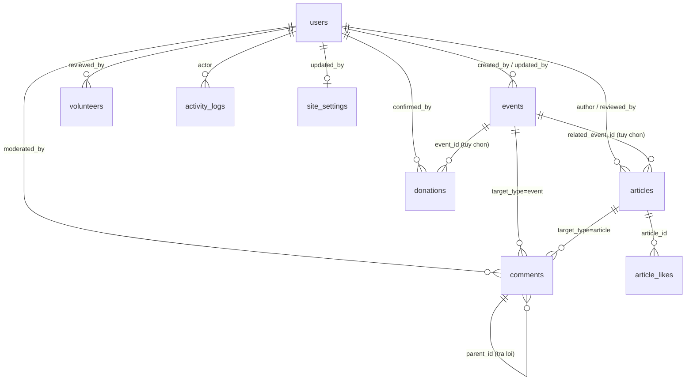

# Database Schema — Nụ Cười Em

Tài liệu mô tả toàn bộ collection trong MongoDB của dự án `nu-cuoi-em-web`.

| Hạng mục | Giá trị |
|----------|---------|
| Database | MongoDB Atlas (free tier M0 — 512MB) |
| Driver / ORM | Django 5.x + [`django-mongodb-backend`](https://github.com/mongodb/django-mongodb-backend) |
| Tên database | `nu_cuoi_em` (biến `MONGODB_DB_NAME`) |
| Chuỗi kết nối | `MONGODB_URI` trong `backend/.env` |
| File ảnh/video | **Không lưu trong Mongo** — chỉ lưu URL + `public_id` của Cloudinary |

> **Trạng thái tài liệu:** đây là bản thiết kế chuẩn (source of truth) cho các
> `models.py` trong `backend/apps/*`. Khi thay đổi model, phải cập nhật file này
> trong cùng một Pull Request.

---

## 1. Quy ước chung

### 1.1. Đặt tên

- Tên collection: `snake_case`, số nhiều — `events`, `articles`, `comments`.
- Django mặc định sinh tên bảng `<app_label>_<model>` (ví dụ `events_event`).
  Dự án **luôn khai báo `Meta.db_table`** để tên collection ngắn và dễ đọc:

  ```python
  class Event(TimeStampedModel):
      ...
      class Meta:
          db_table = "events"
  ```

- Tên trường: `snake_case`. Khoá ngoại lưu dưới dạng `<tên>_id` kiểu `ObjectId`.

### 1.2. Trường dùng chung

Mọi collection nghiệp vụ kế thừa `apps/common/models.py::TimeStampedModel`:

| Trường | Kiểu Mongo | Kiểu Django | Mô tả |
|--------|-----------|-------------|-------|
| `_id` | `ObjectId` | `ObjectIdAutoField` | Khoá chính, Mongo tự sinh |
| `created_at` | `Date` | `DateTimeField(auto_now_add=True)` | Thời điểm tạo (UTC) |
| `updated_at` | `Date` | `DateTimeField(auto_now=True)` | Thời điểm sửa cuối (UTC) |

- **Mọi mốc thời gian lưu UTC** (`USE_TZ = True`), quy đổi `Asia/Ho_Chi_Minh` ở tầng hiển thị.
- **Không xoá mềm.** Nội dung ngừng hiển thị được chuyển `status = "archived"`;
  chỉ bình luận spam và tin nhắn liên hệ mới bị xoá cứng.
- Tiền tệ dùng `DecimalField` → lưu `Decimal128`, **không dùng `Float`**.

### 1.3. Kiểu nhúng dùng lại (embedded documents)

Khai báo bằng `EmbeddedModelField` / `EmbeddedModelArrayField` của
`django-mongodb-backend`, đặt trong `apps/common/models.py`.

**`Image`** — một ảnh trên Cloudinary:

| Trường | Kiểu | Mô tả |
|--------|------|-------|
| `url` | `String` | URL bản gốc (`secure_url`) |
| `public_id` | `String` | ID Cloudinary, dùng khi xoá/transform |
| `alt` | `String` | Văn bản thay thế (SEO + accessibility) |
| `width` / `height` | `Int` | Kích thước gốc, tránh layout shift |

**`Video`** — video nhúng:

| Trường | Kiểu | Mô tả |
|--------|------|-------|
| `url` | `String` | Link YouTube / Cloudinary |
| `provider` | `String` | `youtube` \| `cloudinary` |
| `thumbnail_url` | `String` | Ảnh đại diện video |
| `caption` | `String` | Chú thích |

**`Location`** — địa điểm sự kiện:

| Trường | Kiểu | Mô tả |
|--------|------|-------|
| `venue` | `String` | Tên địa điểm (VD: Lớp trẻ "Gia Đình") |
| `address` | `String` | Địa chỉ chi tiết |
| `ward` / `district` | `String` | Phường/xã, quận/huyện |
| `province` | `String` | Tỉnh/thành, mặc định `Đắk Lắk` |
| `map_url` | `String` | Link Google Maps |

### 1.4. Danh sách collection

| # | Collection | App Django | Vai trò |
|---|-----------|-----------|---------|
| 1 | `users` | `apps.accounts` | Tài khoản quản trị + phân quyền |
| 2 | `events` | `apps.events` | Sự kiện / chương trình |
| 3 | `articles` | `apps.news` | Bài viết, tin tức, câu chuyện |
| 4 | `article_likes` | `apps.news` | Lượt thích bài viết (chống trùng) |
| 5 | `comments` | `apps.comments` | Bình luận cho sự kiện & bài viết |
| 6 | `donations` | `apps.donations` | Khoản quyên góp tiền / vật dụng |
| 7 | `volunteers` | `apps.volunteers` | Đơn đăng ký tình nguyện viên |
| 8 | `contact_messages` | `apps.sitesettings` | Tin nhắn từ form liên hệ |
| 9 | `site_settings` | `apps.sitesettings` | Cấu hình website (singleton) |
| 10 | `activity_logs` | `apps.common` | Nhật ký thao tác quản trị |
| — | `django_*`, `auth_*`, `token_blacklist_*` | hệ thống | Xem [§13](#13-collection-hệ-thống) |

### 1.5. Sơ đồ quan hệ



---

## 2. `users` — Tài khoản quản trị

App `apps.accounts`. Custom user model (`AUTH_USER_MODEL = "accounts.User"`),
đăng nhập bằng **email** thay cho username, xác thực bằng JWT
(`djangorestframework-simplejwt`).

> Khách truy cập **không cần tài khoản** để bình luận, gửi bài, quyên góp hay
> đăng ký tình nguyện viên. Collection này chỉ chứa người vận hành website.

| Trường | Kiểu Mongo | Kiểu Django | Bắt buộc | Mặc định | Mô tả |
|--------|-----------|-------------|:--------:|----------|-------|
| `_id` | `ObjectId` | `ObjectIdAutoField` | ✔ | auto | Khoá chính |
| `email` | `String` | `EmailField(unique=True)` | ✔ | — | Định danh đăng nhập, luôn lowercase |
| `password` | `String` | `CharField(128)` | ✔ | — | Hash PBKDF2-SHA256 do Django sinh |
| `full_name` | `String` | `CharField(150)` | ✔ | — | Họ tên hiển thị |
| `phone` | `String` | `CharField(20)` | ✘ | `""` | Số điện thoại liên hệ nội bộ |
| `avatar` | `Object` | `EmbeddedModelField(Image)` | ✘ | `null` | Ảnh đại diện |
| `role` | `String` | `CharField(choices)` | ✔ | `"moderator"` | Vai trò, xem §2.1 |
| `extra_permissions` | `Array<String>` | `ArrayField(CharField)` | ✘ | `[]` | Quyền cấp thêm ngoài `role` |
| `is_active` | `Bool` | `BooleanField` | ✔ | `true` | `false` = khoá tài khoản |
| `is_staff` | `Bool` | `BooleanField` | ✔ | `true` | Truy cập được Django Admin |
| `is_superuser` | `Bool` | `BooleanField` | ✔ | `false` | Bỏ qua mọi kiểm tra quyền |
| `must_change_password` | `Bool` | `BooleanField` | ✔ | `false` | Buộc đổi mật khẩu lần đăng nhập đầu |
| `last_login` | `Date` | `DateTimeField` | ✘ | `null` | Lần đăng nhập gần nhất |
| `date_joined` | `Date` | `DateTimeField` | ✔ | `now` | Ngày tạo tài khoản |
| `created_at` / `updated_at` | `Date` | — | ✔ | auto | §1.2 |

### 2.1. Vai trò (`role`) và quyền

| `role` | Nhãn | Quyền mặc định |
|--------|------|----------------|
| `superadmin` | Quản trị viên cấp cao | Toàn quyền, kể cả quản lý tài khoản & cài đặt |
| `event_manager` | Quản lý sự kiện | `events.*` |
| `news_editor` | Biên tập / duyệt bài | `articles.*` |
| `donation_manager` | Quản lý quyên góp | `donations.*`, `reports.export` |
| `volunteer_manager` | Quản lý tình nguyện viên | `volunteers.*` |
| `moderator` | Kiểm duyệt viên | `comments.*`, `contact.*` |

Mã quyền dùng trong `extra_permissions` (khớp `apps/accounts/permissions.py`):

```
events.view     events.create    events.update    events.delete    events.publish
articles.view   articles.create  articles.update  articles.delete  articles.review
comments.view   comments.moderate
donations.view  donations.manage
volunteers.view volunteers.review
contact.view    contact.handle
users.manage    settings.manage  reports.export
```

Quyền hiệu lực = quyền mặc định của `role` **∪** `extra_permissions`.
`is_superuser = true` bỏ qua mọi kiểm tra.

### 2.2. Index

| Index | Kiểu | Ghi chú |
|-------|------|---------|
| `{ email: 1 }` | unique | Khoá đăng nhập |
| `{ role: 1, is_active: 1 }` | thường | Lọc danh sách admin |

### 2.3. Ví dụ document

```json
{
  "_id": { "$oid": "66f0a1b2c3d4e5f601000001" },
  "email": "admin@nucuoiem.org",
  "password": "pbkdf2_sha256$870000$...",
  "full_name": "Ngô Minh Hiếu",
  "phone": "0905123456",
  "avatar": null,
  "role": "superadmin",
  "extra_permissions": [],
  "is_active": true,
  "is_staff": true,
  "is_superuser": true,
  "must_change_password": false,
  "last_login": { "$date": "2026-09-08T02:11:04.000Z" },
  "date_joined": { "$date": "2026-01-05T09:00:00.000Z" },
  "created_at": { "$date": "2026-01-05T09:00:00.000Z" },
  "updated_at": { "$date": "2026-09-08T02:11:04.000Z" }
}
```

---

## 3. `events` — Sự kiện / chương trình

App `apps.events`. Phục vụ trang `/events`, `/events/:slug` và mục "Quản lý sự kiện".

| Trường | Kiểu Mongo | Kiểu Django | Bắt buộc | Mặc định | Mô tả |
|--------|-----------|-------------|:--------:|----------|-------|
| `_id` | `ObjectId` | `ObjectIdAutoField` | ✔ | auto | Khoá chính |
| `title` | `String` | `CharField(200)` | ✔ | — | Tiêu đề sự kiện |
| `slug` | `String` | `SlugField(220, unique=True)` | ✔ | sinh từ `title` | Dùng cho URL, không dấu |
| `summary` | `String` | `CharField(300)` | ✔ | — | Mô tả ngắn hiển thị ở card |
| `description` | `String` | `TextField` | ✔ | — | Nội dung chi tiết (HTML từ WYSIWYG) |
| `event_type` | `String` | `CharField(choices)` | ✔ | `"khac"` | Loại sự kiện, xem §3.1 |
| `school_name` | `String` | `CharField(150)` | ✘ | `""` | Trường / lớp tổ chức — dùng cho bộ lọc |
| `location` | `Object` | `EmbeddedModelField(Location)` | ✘ | `null` | Địa điểm |
| `start_at` | `Date` | `DateTimeField` | ✔ | — | Thời gian bắt đầu |
| `end_at` | `Date` | `DateTimeField` | ✘ | `null` | Thời gian kết thúc |
| `cover_image` | `Object` | `EmbeddedModelField(Image)` | ✘ | `null` | Ảnh bìa |
| `gallery` | `Array<Object>` | `EmbeddedModelArrayField(Image)` | ✘ | `[]` | Album ảnh |
| `videos` | `Array<Object>` | `EmbeddedModelArrayField(Video)` | ✘ | `[]` | Video ngắn |
| `stats` | `Object` | `EmbeddedModelField(EventStats)` | ✔ | zeros | Thống kê tác động, xem §3.2 |
| `status` | `String` | `CharField(choices)` | ✔ | `"draft"` | `draft` \| `scheduled` \| `published` \| `archived` |
| `publish_at` | `Date` | `DateTimeField` | ✘ | `null` | Mốc tự động công bố (`status = scheduled`) |
| `published_at` | `Date` | `DateTimeField` | ✘ | `null` | Thời điểm thực sự được công bố |
| `is_featured` | `Bool` | `BooleanField` | ✔ | `false` | Ghim lên trang chủ |
| `allow_comments` | `Bool` | `BooleanField` | ✔ | `true` | Cho phép gửi cảm nhận |
| `view_count` | `Int` | `PositiveIntegerField` | ✔ | `0` | Lượt xem (tăng bằng `$inc`) |
| `comment_count` | `Int` | `PositiveIntegerField` | ✔ | `0` | Số bình luận **đã duyệt** (denormalized) |
| `created_by_id` | `ObjectId` | `FK → users` | ✔ | — | Người tạo |
| `updated_by_id` | `ObjectId` | `FK → users (null)` | ✘ | `null` | Người sửa cuối |
| `created_at` / `updated_at` | `Date` | — | ✔ | auto | §1.2 |

### 3.1. `event_type`

| Giá trị | Nhãn |
|---------|------|
| `ve_tranh` | Vẽ tranh acrylic |
| `nan_dat_set` | Nặn đất sét màu |
| `van_nghe` | Văn nghệ giao lưu |
| `quyen_gop` | Chương trình quyên góp / trao quà |
| `khac` | Khác |

### 3.2. Embedded `EventStats`

| Trường | Kiểu | Mặc định | Mô tả |
|--------|------|----------|-------|
| `children_helped` | `Int` | `0` | Số trẻ được hỗ trợ |
| `volunteers_joined` | `Int` | `0` | Số tình nguyện viên tham gia |
| `funds_raised` | `Decimal128` | `0` | Kinh phí huy động được (VND) |

### 3.3. Vòng đời `status`

```
draft ──(đặt publish_at)──► scheduled ──(cron)──► published ──► archived
  └────────────(công bố ngay)────────────────────────┘
```

`backend/apps/events/management/commands/publish_scheduled_events.py` chạy định kỳ
(systemd timer `nu-cuoi-em-scheduler.timer`), tìm `status = "scheduled"` và
`publish_at <= now`, rồi chuyển sang `published` + set `published_at`.

### 3.4. Index

| Index | Kiểu | Mục đích |
|-------|------|----------|
| `{ slug: 1 }` | unique | Truy cập theo URL |
| `{ status: 1, start_at: -1 }` | thường | Danh sách công khai, sắp xếp mới nhất |
| `{ status: 1, publish_at: 1 }` | thường | Job tự động công bố |
| `{ event_type: 1, status: 1 }` | thường | Bộ lọc theo loại |
| `{ school_name: 1, status: 1 }` | thường | Bộ lọc theo trường |
| `{ is_featured: -1, published_at: -1 }` | thường | Sự kiện nổi bật trang chủ |
| `{ title: "text", summary: "text" }` | text | Tìm kiếm từ khoá |

### 3.5. Ví dụ document

```json
{
  "_id": { "$oid": "66f0a1b2c3d4e5f602000001" },
  "title": "Ngày hội vẽ tranh acrylic cùng lớp Gia Đình",
  "slug": "ngay-hoi-ve-tranh-acrylic-cung-lop-gia-dinh",
  "summary": "Buổi vẽ tranh acrylic dành cho 25 bé tại lớp trẻ Gia Đình.",
  "description": "<p>Sáng ngày 15/03, nhóm Nụ Cười Em đã...</p>",
  "event_type": "ve_tranh",
  "school_name": "Lớp trẻ Gia Đình",
  "location": {
    "venue": "Lớp trẻ Gia Đình",
    "address": "123 Lê Duẩn",
    "ward": "Tân Lập",
    "district": "TP. Buôn Ma Thuột",
    "province": "Đắk Lắk",
    "map_url": "https://maps.app.goo.gl/xxxx"
  },
  "start_at": { "$date": "2026-03-15T01:00:00.000Z" },
  "end_at": { "$date": "2026-03-15T04:30:00.000Z" },
  "cover_image": {
    "url": "https://res.cloudinary.com/nce/image/upload/v1/events/ve-tranh.jpg",
    "public_id": "events/ve-tranh",
    "alt": "Các bé vẽ tranh acrylic",
    "width": 1600,
    "height": 900
  },
  "gallery": [],
  "videos": [],
  "stats": {
    "children_helped": 25,
    "volunteers_joined": 12,
    "funds_raised": { "$numberDecimal": "3500000" }
  },
  "status": "published",
  "publish_at": null,
  "published_at": { "$date": "2026-03-16T02:00:00.000Z" },
  "is_featured": true,
  "allow_comments": true,
  "view_count": 412,
  "comment_count": 7,
  "created_by_id": { "$oid": "66f0a1b2c3d4e5f601000001" },
  "updated_by_id": null,
  "created_at": { "$date": "2026-03-14T08:00:00.000Z" },
  "updated_at": { "$date": "2026-03-16T02:00:00.000Z" }
}
```

---

## 4. `articles` — Bài viết / tin tức

App `apps.news`. Gồm **bài do admin viết** và **bài do cộng đồng gửi** (bắt buộc
qua kiểm duyệt trước khi công bố).

| Trường | Kiểu Mongo | Kiểu Django | Bắt buộc | Mặc định | Mô tả |
|--------|-----------|-------------|:--------:|----------|-------|
| `_id` | `ObjectId` | `ObjectIdAutoField` | ✔ | auto | Khoá chính |
| `title` | `String` | `CharField(200)` | ✔ | — | Tiêu đề |
| `slug` | `String` | `SlugField(220, unique=True)` | ✔ | sinh từ `title` | URL bài viết |
| `excerpt` | `String` | `CharField(300)` | ✘ | trích `content` | Mô tả ngắn |
| `content` | `String` | `TextField` | ✔ | — | Nội dung HTML từ WYSIWYG, **phải sanitize** |
| `cover_image` | `Object` | `EmbeddedModelField(Image)` | ✘ | `null` | Ảnh đại diện |
| `gallery` | `Array<Object>` | `EmbeddedModelArrayField(Image)` | ✘ | `[]` | Ảnh trong bài |
| `tags` | `Array<String>` | `ArrayField(CharField(50))` | ✘ | `[]` | Nhãn phân loại, xem §4.1 |
| `source` | `String` | `CharField(choices)` | ✔ | `"admin"` | `admin` \| `community` |
| `author` | `Object` | `EmbeddedModelField(AuthorInfo)` | ✔ | — | Tác giả, xem §4.2 |
| `related_event_id` | `ObjectId` | `FK → events (null)` | ✘ | `null` | Sự kiện liên quan |
| `status` | `String` | `CharField(choices)` | ✔ | `"draft"` | Xem §4.3 |
| `review` | `Object` | `EmbeddedModelField(ReviewInfo)` | ✘ | `null` | Kết quả kiểm duyệt, xem §4.4 |
| `publish_at` | `Date` | `DateTimeField` | ✘ | `null` | Hẹn giờ công bố |
| `published_at` | `Date` | `DateTimeField` | ✘ | `null` | Thời điểm công bố thực tế |
| `is_featured` | `Bool` | `BooleanField` | ✔ | `false` | Ghim trang chủ |
| `allow_comments` | `Bool` | `BooleanField` | ✔ | `true` | Cho phép bình luận |
| `view_count` | `Int` | `PositiveIntegerField` | ✔ | `0` | Lượt xem |
| `like_count` | `Int` | `PositiveIntegerField` | ✔ | `0` | Lượt thích (denormalized từ `article_likes`) |
| `comment_count` | `Int` | `PositiveIntegerField` | ✔ | `0` | Bình luận đã duyệt |
| `created_at` / `updated_at` | `Date` | — | ✔ | auto | §1.2 |

### 4.1. `tags` gợi ý

`hoat-dong`, `cau-chuyen`, `hoc-tap`, `tinh-nguyen`, `quyen-gop`, `thong-bao`.

Lưu dạng slug không dấu; nhãn hiển thị nằm ở `frontend/src/utils/constants.js`.
Không tách thành collection riêng — số lượng nhãn nhỏ và ít thay đổi.

### 4.2. Embedded `AuthorInfo`

| Trường | Kiểu | Bắt buộc | Mô tả |
|--------|------|:--------:|-------|
| `user_id` | `ObjectId` | ✘ | Trỏ tới `users` nếu tác giả là admin; `null` với bài cộng đồng |
| `display_name` | `String` | ✔ | Tên hiển thị |
| `email` | `String` | ✔ | Email liên hệ / gửi kết quả duyệt. **Không hiển thị công khai** |
| `is_guest` | `Bool` | ✔ | `true` khi bài do khách gửi |

### 4.3. Vòng đời `status`

| Giá trị | Ý nghĩa |
|---------|---------|
| `draft` | Admin đang soạn, chưa gửi |
| `pending` | Chờ duyệt (mặc định cho bài `source = "community"`) |
| `scheduled` | Đã duyệt, chờ tới `publish_at` |
| `published` | Đang hiển thị công khai |
| `rejected` | Bị từ chối, kèm `review.note` |
| `archived` | Gỡ khỏi trang công khai nhưng giữ dữ liệu |

```
        (khách gửi)                  (admin duyệt)
guest ──────────────► pending ──────────────────► published / scheduled
                         └──(từ chối, ghi chú)──► rejected

admin ──► draft ──────────────────────────────► published ──► archived
```

### 4.4. Embedded `ReviewInfo`

| Trường | Kiểu | Mô tả |
|--------|------|-------|
| `reviewed_by_id` | `ObjectId` | Admin thực hiện duyệt |
| `reviewed_at` | `Date` | Thời điểm duyệt |
| `decision` | `String` | `approved` \| `rejected` |
| `note` | `String` | Ghi chú gửi kèm cho tác giả |
| `edited_before_publish` | `Bool` | Admin có sửa nội dung trước khi công bố hay không |

### 4.5. Index

| Index | Kiểu | Mục đích |
|-------|------|----------|
| `{ slug: 1 }` | unique | Truy cập theo URL |
| `{ status: 1, published_at: -1 }` | thường | Danh sách tin tức |
| `{ status: 1, publish_at: 1 }` | thường | Job hẹn giờ công bố |
| `{ source: 1, status: 1, created_at: -1 }` | thường | Hàng đợi duyệt bài cộng đồng |
| `{ tags: 1, status: 1 }` | multikey | Lọc theo nhãn |
| `{ related_event_id: 1 }` | thường | Bài viết của một sự kiện |
| `{ title: "text", excerpt: "text", content: "text" }` | text | Tìm kiếm |

### 4.6. Ví dụ document

```json
{
  "_id": { "$oid": "66f0a1b2c3d4e5f603000001" },
  "title": "Bức tranh đầu tiên của bé An",
  "slug": "buc-tranh-dau-tien-cua-be-an",
  "excerpt": "Sau ba buổi học vẽ, An đã hoàn thành bức tranh đầu tiên.",
  "content": "<p>An là một cậu bé ít nói...</p>",
  "cover_image": {
    "url": "https://res.cloudinary.com/nce/image/upload/v1/news/be-an.jpg",
    "public_id": "news/be-an",
    "alt": "Bức tranh của bé An",
    "width": 1200,
    "height": 800
  },
  "gallery": [],
  "tags": ["cau-chuyen", "hoat-dong"],
  "source": "community",
  "author": {
    "user_id": null,
    "display_name": "Nguyễn Thị Lan",
    "email": "lan.nguyen@example.com",
    "is_guest": true
  },
  "related_event_id": { "$oid": "66f0a1b2c3d4e5f602000001" },
  "status": "published",
  "review": {
    "reviewed_by_id": { "$oid": "66f0a1b2c3d4e5f601000001" },
    "reviewed_at": { "$date": "2026-03-20T03:15:00.000Z" },
    "decision": "approved",
    "note": "Bài viết cảm động, đã chỉnh chính tả.",
    "edited_before_publish": true
  },
  "publish_at": null,
  "published_at": { "$date": "2026-03-20T03:20:00.000Z" },
  "is_featured": false,
  "allow_comments": true,
  "view_count": 158,
  "like_count": 34,
  "comment_count": 3,
  "created_at": { "$date": "2026-03-19T12:40:00.000Z" },
  "updated_at": { "$date": "2026-03-20T03:20:00.000Z" }
}
```

---

## 5. `article_likes` — Lượt thích bài viết

App `apps.news`. Tách riêng để **chống thích trùng** khi khách không đăng nhập.
`articles.like_count` là bản denormalized của collection này.

| Trường | Kiểu Mongo | Kiểu Django | Bắt buộc | Mặc định | Mô tả |
|--------|-----------|-------------|:--------:|----------|-------|
| `_id` | `ObjectId` | `ObjectIdAutoField` | ✔ | auto | Khoá chính |
| `article_id` | `ObjectId` | `FK → articles` | ✔ | — | Bài được thích |
| `visitor_key` | `String` | `CharField(64)` | ✔ | — | SHA-256 của `client_uuid` (localStorage) hoặc `ip + user_agent` |
| `user_id` | `ObjectId` | `FK → users (null)` | ✘ | `null` | Có giá trị nếu người thích là admin đã đăng nhập |
| `created_at` | `Date` | `DateTimeField` | ✔ | auto | Thời điểm thích |

### 5.1. Index

| Index | Kiểu | Mục đích |
|-------|------|----------|
| `{ article_id: 1, visitor_key: 1 }` | unique | Mỗi khách chỉ thích 1 lần |
| `{ article_id: 1 }` | thường | Đếm lại `like_count` khi cần đồng bộ |

> **Riêng tư:** không lưu IP thô, chỉ lưu hash. `visitor_key` không dùng để định
> danh người dùng ở bất kỳ nghiệp vụ nào khác.

---

## 6. `comments` — Bình luận & cảm nhận

App `apps.comments`. Dùng chung cho sự kiện và bài viết theo mẫu **polymorphic**
(`target_type` + `target_id`) — MongoDB không có ràng buộc khoá ngoại nên cách
này gọn hơn hai collection riêng.

**Mọi bình luận đều mặc định `pending` và chỉ hiển thị sau khi admin duyệt.**

| Trường | Kiểu Mongo | Kiểu Django | Bắt buộc | Mặc định | Mô tả |
|--------|-----------|-------------|:--------:|----------|-------|
| `_id` | `ObjectId` | `ObjectIdAutoField` | ✔ | auto | Khoá chính |
| `target_type` | `String` | `CharField(choices)` | ✔ | — | `event` \| `article` |
| `target_id` | `ObjectId` | `ObjectIdField` | ✔ | — | `_id` của sự kiện / bài viết |
| `parent_id` | `ObjectId` | `FK → comments (null)` | ✘ | `null` | Bình luận cha (admin trả lời) — chỉ hỗ trợ 1 cấp |
| `author` | `Object` | `EmbeddedModelField(CommentAuthor)` | ✔ | — | Người bình luận, xem §6.1 |
| `content` | `String` | `TextField(max_length=2000)` | ✔ | — | Nội dung **plain text**, escape khi render |
| `status` | `String` | `CharField(choices)` | ✔ | `"pending"` | `pending` \| `approved` \| `rejected` \| `spam` |
| `moderated_by_id` | `ObjectId` | `FK → users (null)` | ✘ | `null` | Người kiểm duyệt |
| `moderated_at` | `Date` | `DateTimeField` | ✘ | `null` | Thời điểm kiểm duyệt |
| `moderation_note` | `String` | `CharField(300)` | ✘ | `""` | Lý do từ chối (nội bộ) |
| `ip_hash` | `String` | `CharField(64)` | ✘ | `""` | SHA-256 của IP — chống spam, rate limit |
| `user_agent` | `String` | `CharField(300)` | ✘ | `""` | Hỗ trợ phát hiện bot |
| `created_at` / `updated_at` | `Date` | — | ✔ | auto | §1.2 |

### 6.1. Embedded `CommentAuthor`

| Trường | Kiểu | Bắt buộc | Mô tả |
|--------|------|:--------:|-------|
| `user_id` | `ObjectId` | ✘ | Trỏ tới `users` khi admin trả lời |
| `display_name` | `String` | ✔ | Tên hiển thị công khai |
| `email` | `String` | ✘ | Chỉ dùng nội bộ, **không trả về API công khai** |
| `is_staff` | `Bool` | ✔ | `true` → hiển thị nhãn "Ban quản trị" |

### 6.2. Index

| Index | Kiểu | Mục đích |
|-------|------|----------|
| `{ target_type: 1, target_id: 1, status: 1, created_at: -1 }` | thường | Danh sách bình luận công khai |
| `{ status: 1, created_at: -1 }` | thường | Hàng đợi kiểm duyệt trong dashboard |
| `{ parent_id: 1 }` | thường | Lấy phản hồi của một bình luận |
| `{ ip_hash: 1, created_at: -1 }` | thường | Rate limit / phát hiện spam |

### 6.3. Quy tắc nghiệp vụ

- Khi một bình luận chuyển sang `approved`, tăng `comment_count` của
  `events`/`articles` tương ứng bằng `$inc`; khi rời khỏi `approved` thì giảm.
- Bình luận `spam` được phép xoá cứng sau 30 ngày để tiết kiệm dung lượng free tier.
- Chỉ tài khoản có quyền `comments.moderate` được đổi `status` hoặc tạo `parent_id`.

### 6.4. Ví dụ document

```json
{
  "_id": { "$oid": "66f0a1b2c3d4e5f604000001" },
  "target_type": "event",
  "target_id": { "$oid": "66f0a1b2c3d4e5f602000001" },
  "parent_id": null,
  "author": {
    "user_id": null,
    "display_name": "Trần Văn Bình",
    "email": "binh.tran@example.com",
    "is_staff": false
  },
  "content": "Chương trình rất ý nghĩa, mong nhóm tổ chức thêm nhiều buổi nữa!",
  "status": "approved",
  "moderated_by_id": { "$oid": "66f0a1b2c3d4e5f601000001" },
  "moderated_at": { "$date": "2026-03-17T01:05:00.000Z" },
  "moderation_note": "",
  "ip_hash": "9f2c...e41a",
  "user_agent": "Mozilla/5.0 (Windows NT 10.0; Win64; x64)",
  "created_at": { "$date": "2026-03-16T15:22:00.000Z" },
  "updated_at": { "$date": "2026-03-17T01:05:00.000Z" }
}
```

---

## 7. `donations` — Quyên góp

App `apps.donations`. Ghi nhận cả **tiền mặt** (chuyển khoản) lẫn **vật dụng**
(sách, đồ chơi, quần áo).

> Website **không xử lý thanh toán trực tuyến**. Người quyên góp chuyển khoản
> theo thông tin trong `site_settings.bank_accounts`, sau đó khai báo qua form;
> admin đối chiếu sao kê rồi chuyển `status` sang `confirmed`.

| Trường | Kiểu Mongo | Kiểu Django | Bắt buộc | Mặc định | Mô tả |
|--------|-----------|-------------|:--------:|----------|-------|
| `_id` | `ObjectId` | `ObjectIdAutoField` | ✔ | auto | Khoá chính |
| `code` | `String` | `CharField(24, unique=True)` | ✔ | sinh tự động | Mã tra cứu, dạng `NCE-2026-000123` |
| `donor` | `Object` | `EmbeddedModelField(DonorInfo)` | ✔ | — | Thông tin người quyên góp, xem §7.1 |
| `kind` | `String` | `CharField(choices)` | ✔ | `"cash"` | `cash` \| `goods` \| `other` |
| `amount` | `Decimal128` | `DecimalField(15, 0)` | ✘ | `0` | Số tiền (VND) — bắt buộc khi `kind = "cash"` |
| `currency` | `String` | `CharField(3)` | ✔ | `"VND"` | Mã tiền tệ ISO 4217 |
| `items` | `Array<Object>` | `EmbeddedModelArrayField(DonationItem)` | ✘ | `[]` | Danh sách vật phẩm — bắt buộc khi `kind = "goods"` |
| `method` | `String` | `CharField(choices)` | ✔ | `"bank_transfer"` | `bank_transfer` \| `cash_on_site` \| `e_wallet` \| `in_kind` \| `other` |
| `bank_reference` | `String` | `CharField(100)` | ✘ | `""` | Mã giao dịch / nội dung chuyển khoản |
| `event_id` | `ObjectId` | `FK → events (null)` | ✘ | `null` | Quyên góp cho một sự kiện cụ thể |
| `status` | `String` | `CharField(choices)` | ✔ | `"pending"` | `pending` \| `confirmed` \| `rejected` \| `cancelled` |
| `received_at` | `Date` | `DateTimeField` | ✘ | `null` | Ngày thực nhận (dùng cho báo cáo tài chính) |
| `confirmed_by_id` | `ObjectId` | `FK → users (null)` | ✘ | `null` | Admin xác nhận |
| `confirmed_at` | `Date` | `DateTimeField` | ✘ | `null` | Thời điểm xác nhận |
| `admin_note` | `String` | `TextField` | ✘ | `""` | Ghi chú nội bộ cho từng khoản |
| `is_public` | `Bool` | `BooleanField` | ✔ | `true` | Hiển thị trong "Quyên góp gần đây" |
| `created_at` / `updated_at` | `Date` | — | ✔ | auto | §1.2 |

### 7.1. Embedded `DonorInfo`

| Trường | Kiểu | Bắt buộc | Mô tả |
|--------|------|:--------:|-------|
| `full_name` | `String` | ✔ | Họ tên người quyên góp |
| `email` | `String` | ✘ | Gửi thư cảm ơn |
| `phone` | `String` | ✘ | Liên hệ khi cần đối chiếu |
| `is_anonymous` | `Bool` | ✔ | `true` → API công khai trả `"Nhà hảo tâm ẩn danh"` |
| `message` | `String` | ✘ | Lời nhắn gửi tới các bé |

### 7.2. Embedded `DonationItem`

| Trường | Kiểu | Bắt buộc | Mô tả |
|--------|------|:--------:|-------|
| `name` | `String` | ✔ | Tên vật phẩm (VD: Sách thiếu nhi) |
| `quantity` | `Int` | ✔ | Số lượng |
| `unit` | `String` | ✔ | Đơn vị (cuốn, bộ, kg…) |
| `estimated_value` | `Decimal128` | ✘ | Giá trị quy đổi ước tính (VND) |

### 7.3. Quy tắc hiển thị công khai

Endpoint công khai `GET /api/donations/recent` **luôn** che danh tính:

- `donor.full_name` → viết tắt (`Nguyễn Văn A` → `Nguyễn V. A.`), hoặc
  `"Nhà hảo tâm ẩn danh"` khi `is_anonymous = true`.
- **Không bao giờ** trả `donor.email`, `donor.phone`, `bank_reference`, `admin_note`.
- Chỉ trả bản ghi `status = "confirmed"` **và** `is_public = true`.

### 7.4. Index

| Index | Kiểu | Mục đích |
|-------|------|----------|
| `{ code: 1 }` | unique | Tra cứu theo mã |
| `{ status: 1, received_at: -1 }` | thường | Danh sách gần đây + báo cáo |
| `{ kind: 1, status: 1 }` | thường | Thống kê theo loại |
| `{ event_id: 1, status: 1 }` | thường | Tổng quyên góp theo sự kiện |
| `{ "donor.email": 1 }` | sparse | Tra lịch sử của một nhà hảo tâm |
| `{ created_at: -1 }` | thường | Sắp xếp mặc định trong admin |

### 7.5. Ví dụ document

```json
{
  "_id": { "$oid": "66f0a1b2c3d4e5f605000001" },
  "code": "NCE-2026-000123",
  "donor": {
    "full_name": "Nguyễn Văn An",
    "email": "an.nguyen@example.com",
    "phone": "0912345678",
    "is_anonymous": false,
    "message": "Chúc các bé luôn vui khoẻ!"
  },
  "kind": "cash",
  "amount": { "$numberDecimal": "2000000" },
  "currency": "VND",
  "items": [],
  "method": "bank_transfer",
  "bank_reference": "FT26031512345678",
  "event_id": { "$oid": "66f0a1b2c3d4e5f602000001" },
  "status": "confirmed",
  "received_at": { "$date": "2026-03-15T00:00:00.000Z" },
  "confirmed_by_id": { "$oid": "66f0a1b2c3d4e5f601000001" },
  "confirmed_at": { "$date": "2026-03-16T02:30:00.000Z" },
  "admin_note": "Đã đối chiếu sao kê Vietcombank ngày 15/03.",
  "is_public": true,
  "created_at": { "$date": "2026-03-15T08:10:00.000Z" },
  "updated_at": { "$date": "2026-03-16T02:30:00.000Z" }
}
```

---

## 8. `volunteers` — Đơn đăng ký tình nguyện viên

App `apps.volunteers`. Mỗi document là **một đơn đăng ký**; cùng một người có thể
nộp nhiều đơn ở các đợt khác nhau nên `email` không unique.

| Trường | Kiểu Mongo | Kiểu Django | Bắt buộc | Mặc định | Mô tả |
|--------|-----------|-------------|:--------:|----------|-------|
| `_id` | `ObjectId` | `ObjectIdAutoField` | ✔ | auto | Khoá chính |
| `full_name` | `String` | `CharField(150)` | ✔ | — | Họ tên |
| `email` | `String` | `EmailField` | ✔ | — | Email nhận kết quả phê duyệt |
| `phone` | `String` | `CharField(20)` | ✔ | — | Số điện thoại |
| `date_of_birth` | `Date` | `DateField` | ✘ | `null` | Ngày sinh (kiểm tra ≥ 16 tuổi) |
| `gender` | `String` | `CharField(choices)` | ✘ | `""` | `male` \| `female` \| `other` |
| `occupation` | `String` | `CharField(120)` | ✘ | `""` | Nghề nghiệp / trường đang học |
| `address` | `String` | `CharField(255)` | ✘ | `""` | Địa chỉ hiện tại |
| `roles` | `Array<String>` | `ArrayField(CharField)` | ✔ | — | Vai trò mong muốn, xem §8.1 |
| `skills` | `Array<String>` | `ArrayField(CharField(50))` | ✘ | `[]` | Kỹ năng (vẽ, đàn, thiết kế, dựng phim…) |
| `availability` | `Object` | `EmbeddedModelField(Availability)` | ✔ | — | Thời gian rảnh, xem §8.2 |
| `experience` | `String` | `TextField` | ✘ | `""` | Kinh nghiệm tình nguyện trước đây |
| `motivation` | `String` | `TextField` | ✘ | `""` | Lý do muốn tham gia |
| `status` | `String` | `CharField(choices)` | ✔ | `"new"` | `new` \| `reviewing` \| `approved` \| `rejected` |
| `reviewed_by_id` | `ObjectId` | `FK → users (null)` | ✘ | `null` | Admin xử lý đơn |
| `reviewed_at` | `Date` | `DateTimeField` | ✘ | `null` | Thời điểm xử lý |
| `review_note` | `String` | `TextField` | ✘ | `""` | Ghi chú gửi kèm email kết quả |
| `notification` | `Object` | `EmbeddedModelField(NotificationLog)` | ✘ | `null` | Trạng thái gửi email, xem §8.3 |
| `ip_hash` | `String` | `CharField(64)` | ✘ | `""` | Chống spam form |
| `created_at` / `updated_at` | `Date` | — | ✔ | auto | §1.2 |

### 8.1. `roles`

| Giá trị | Nhãn |
|---------|------|
| `event_organizer` | Tổ chức sự kiện |
| `teaching` | Dạy học / hướng dẫn nghệ thuật |
| `technical_support` | Hỗ trợ kỹ thuật |
| `fundraising` | Gây quỹ |
| `media` | Truyền thông, chụp ảnh, dựng phim |
| `other` | Khác |

### 8.2. Embedded `Availability`

| Trường | Kiểu | Mô tả |
|--------|------|-------|
| `weekdays` | `Array<Int>` | `0` = Thứ Hai … `6` = Chủ Nhật |
| `time_slots` | `Array<String>` | `morning` \| `afternoon` \| `evening` |
| `hours_per_week` | `Int` | Số giờ có thể tham gia mỗi tuần |
| `available_from` | `Date` | Có thể bắt đầu từ ngày |

### 8.3. Embedded `NotificationLog`

| Trường | Kiểu | Mô tả |
|--------|------|-------|
| `sent_at` | `Date` | Thời điểm gửi email kết quả |
| `channel` | `String` | `email` (SendGrid / Resend) |
| `status` | `String` | `sent` \| `failed` \| `skipped` |
| `error` | `String` | Thông báo lỗi nếu `failed` |

Logic gửi email nằm ở `backend/apps/volunteers/services.py` +
`backend/services/email_service.py`. Free tier giới hạn **100 email/ngày** —
khi vượt hạn mức, đặt `status = "failed"` và cho phép admin gửi lại thủ công.

### 8.4. Index

| Index | Kiểu | Mục đích |
|-------|------|----------|
| `{ status: 1, created_at: -1 }` | thường | Hàng đợi xử lý đơn |
| `{ email: 1, created_at: -1 }` | thường | Lịch sử đăng ký của một người |
| `{ roles: 1, status: 1 }` | multikey | Lọc theo vai trò |
| `{ ip_hash: 1, created_at: -1 }` | thường | Chống spam |

### 8.5. Ví dụ document

```json
{
  "_id": { "$oid": "66f0a1b2c3d4e5f606000001" },
  "full_name": "Lê Thị Mai",
  "email": "mai.le@example.com",
  "phone": "0987654321",
  "date_of_birth": { "$date": "2004-06-12T00:00:00.000Z" },
  "gender": "female",
  "occupation": "Sinh viên ĐH Tây Nguyên",
  "address": "Buôn Ma Thuột, Đắk Lắk",
  "roles": ["teaching", "media"],
  "skills": ["vẽ acrylic", "chụp ảnh"],
  "availability": {
    "weekdays": [5, 6],
    "time_slots": ["morning", "afternoon"],
    "hours_per_week": 8,
    "available_from": { "$date": "2026-04-01T00:00:00.000Z" }
  },
  "experience": "Từng tham gia CLB tình nguyện của trường 2 năm.",
  "motivation": "Muốn đồng hành cùng các bé qua hoạt động vẽ tranh.",
  "status": "approved",
  "reviewed_by_id": { "$oid": "66f0a1b2c3d4e5f601000001" },
  "reviewed_at": { "$date": "2026-03-22T04:00:00.000Z" },
  "review_note": "Mời bạn tham gia buổi định hướng ngày 05/04.",
  "notification": {
    "sent_at": { "$date": "2026-03-22T04:01:12.000Z" },
    "channel": "email",
    "status": "sent",
    "error": ""
  },
  "ip_hash": "3ab7...9d10",
  "created_at": { "$date": "2026-03-21T10:05:00.000Z" },
  "updated_at": { "$date": "2026-03-22T04:01:12.000Z" }
}
```

---

## 9. `contact_messages` — Tin nhắn liên hệ

App `apps.sitesettings`. Nhận dữ liệu từ form ở trang `/contact`.
Lưu lại trong DB thay vì chỉ gửi email, để không mất liên hệ khi vượt hạn mức
email của free tier.

| Trường | Kiểu Mongo | Kiểu Django | Bắt buộc | Mặc định | Mô tả |
|--------|-----------|-------------|:--------:|----------|-------|
| `_id` | `ObjectId` | `ObjectIdAutoField` | ✔ | auto | Khoá chính |
| `full_name` | `String` | `CharField(150)` | ✔ | — | Người gửi |
| `email` | `String` | `EmailField` | ✔ | — | Email phản hồi |
| `phone` | `String` | `CharField(20)` | ✘ | `""` | Số điện thoại |
| `subject` | `String` | `CharField(200)` | ✔ | — | Tiêu đề |
| `message` | `String` | `TextField(max_length=3000)` | ✔ | — | Nội dung (plain text) |
| `status` | `String` | `CharField(choices)` | ✔ | `"new"` | `new` \| `read` \| `replied` \| `spam` |
| `handled_by_id` | `ObjectId` | `FK → users (null)` | ✘ | `null` | Admin xử lý |
| `handled_at` | `Date` | `DateTimeField` | ✘ | `null` | Thời điểm xử lý |
| `reply_note` | `String` | `TextField` | ✘ | `""` | Tóm tắt nội dung đã phản hồi |
| `ip_hash` | `String` | `CharField(64)` | ✘ | `""` | Chống spam |
| `created_at` / `updated_at` | `Date` | — | ✔ | auto | §1.2 |

### 9.1. Index

| Index | Kiểu | Mục đích |
|-------|------|----------|
| `{ status: 1, created_at: -1 }` | thường | Hộp thư trong dashboard |
| `{ ip_hash: 1, created_at: -1 }` | thường | Rate limit |

Tin nhắn `spam` được phép xoá cứng sau 30 ngày.

---

## 10. `site_settings` — Cấu hình website (singleton)

App `apps.sitesettings`. Collection **chỉ chứa đúng một document**; ràng buộc bằng
trường `singleton_key` với unique index. Model override `save()` để luôn ghi vào
bản ghi này và `delete()` để chặn xoá.

| Trường | Kiểu Mongo | Kiểu Django | Bắt buộc | Mặc định | Mô tả |
|--------|-----------|-------------|:--------:|----------|-------|
| `_id` | `ObjectId` | `ObjectIdAutoField` | ✔ | auto | Khoá chính |
| `singleton_key` | `String` | `CharField(10, unique=True)` | ✔ | `"default"` | Khoá chốt singleton |
| `organization` | `Object` | `EmbeddedModelField` | ✔ | — | Thông tin tổ chức, §10.1 |
| `contact` | `Object` | `EmbeddedModelField` | ✔ | — | Thông tin liên hệ, §10.2 |
| `social` | `Object` | `EmbeddedModelField` | ✘ | `{}` | Mạng xã hội, §10.3 |
| `bank_accounts` | `Array<Object>` | `EmbeddedModelArrayField` | ✘ | `[]` | Tài khoản nhận quyên góp, §10.4 |
| `impact_stats` | `Object` | `EmbeddedModelField` | ✔ | zeros | Số liệu trang chủ, §10.5 |
| `pages` | `Object` | `EmbeddedModelField` | ✘ | `{}` | Nội dung trang tĩnh, §10.6 |
| `email_settings` | `Object` | `EmbeddedModelField` | ✔ | — | Cấu hình email tự động, §10.7 |
| `seo` | `Object` | `EmbeddedModelField` | ✘ | `{}` | Metadata SEO, §10.8 |
| `maintenance_mode` | `Bool` | `BooleanField` | ✔ | `false` | Bật trang bảo trì cho phần công khai |
| `updated_by_id` | `ObjectId` | `FK → users (null)` | ✘ | `null` | Admin sửa cuối |
| `created_at` / `updated_at` | `Date` | — | ✔ | auto | §1.2 |

### 10.1. `organization`

`name`, `short_name`, `tagline`, `description` (`Text`), `founded_year` (`Int`),
`logo` (`Image`), `favicon` (`Image`).

### 10.2. `contact`

`email`, `phone`, `hotline`, `address`, `map_url`, `working_hours`.

### 10.3. `social`

`facebook`, `youtube`, `tiktok`, `instagram`, `zalo` — đều là `URLField`,
rỗng thì ẩn icon tương ứng ở footer.

### 10.4. `bank_accounts[]`

| Trường | Kiểu | Mô tả |
|--------|------|-------|
| `bank_name` | `String` | Tên ngân hàng |
| `account_number` | `String` | Số tài khoản |
| `account_holder` | `String` | Chủ tài khoản |
| `branch` | `String` | Chi nhánh |
| `qr_image` | `Object (Image)` | Ảnh QR VietQR |
| `is_primary` | `Bool` | Tài khoản hiển thị mặc định |

### 10.5. `impact_stats`

| Trường | Kiểu | Mô tả |
|--------|------|-------|
| `children_helped` | `Int` | Số trẻ đã được hỗ trợ |
| `events_held` | `Int` | Số sự kiện đã tổ chức |
| `volunteers_count` | `Int` | Số tình nguyện viên |
| `total_donations` | `Decimal128` | Tổng quyên góp (VND) |
| `auto_calculate` | `Bool` | `true` → tính lại từ `events`/`volunteers`/`donations` |
| `last_calculated_at` | `Date` | Lần tính gần nhất |

Khi `auto_calculate = true`, số liệu được tổng hợp bằng aggregation
(`events.stats.children_helped`, `volunteers` đã `approved`, `donations` đã
`confirmed`) và ghi đè vào đây theo lịch — tránh chạy aggregation ở mỗi lần
tải trang chủ.

### 10.6. `pages`

`about_us`, `privacy_policy`, `terms_of_use`, `transparency_commitment` — đều là
`TextField` chứa HTML từ WYSIWYG, phải sanitize trước khi lưu.

### 10.7. `email_settings`

| Trường | Kiểu | Mô tả |
|--------|------|-------|
| `from_email` | `String` | Địa chỉ gửi (mặc định `DEFAULT_FROM_EMAIL`) |
| `from_name` | `String` | Tên hiển thị người gửi |
| `notify_emails` | `Array<String>` | Danh sách nhận thông báo nội bộ |
| `on_new_volunteer` | `Bool` | Báo admin khi có đơn tình nguyện mới |
| `on_volunteer_result` | `Bool` | Gửi kết quả duyệt cho ứng viên |
| `on_new_donation` | `Bool` | Báo admin khi có khai báo quyên góp |
| `on_new_article` | `Bool` | Báo admin khi có bài chờ duyệt |
| `on_new_contact` | `Bool` | Báo admin khi có tin nhắn liên hệ |
| `daily_quota` | `Int` | Hạn mức email/ngày của nhà cung cấp (mặc định `100`) |

### 10.8. `seo`

`meta_title`, `meta_description`, `og_image` (`Image`), `google_analytics_id`.

### 10.9. Index

| Index | Kiểu | Mục đích |
|-------|------|----------|
| `{ singleton_key: 1 }` | unique | Đảm bảo chỉ có một document |

> **Bảo mật:** `email_settings.notify_emails` và toàn bộ `bank_accounts` chỉ trả
> về đầy đủ cho endpoint admin. Endpoint công khai `GET /api/settings/public`
> chỉ trả `organization`, `contact`, `social`, `impact_stats`, `pages`, `seo` và
> tài khoản ngân hàng có `is_primary = true`.

---

## 11. `activity_logs` — Nhật ký thao tác quản trị

App `apps.common`. Ghi lại các hành động nhạy cảm để phục vụ đối soát và minh
bạch (duyệt bài, xác nhận quyên góp, đổi cài đặt, đổi quyền tài khoản).

| Trường | Kiểu Mongo | Kiểu Django | Bắt buộc | Mặc định | Mô tả |
|--------|-----------|-------------|:--------:|----------|-------|
| `_id` | `ObjectId` | `ObjectIdAutoField` | ✔ | auto | Khoá chính |
| `actor_id` | `ObjectId` | `FK → users` | ✔ | — | Người thực hiện |
| `actor_email` | `String` | `CharField(254)` | ✔ | — | Lưu kèm để log còn ý nghĩa nếu tài khoản bị xoá |
| `action` | `String` | `CharField(50)` | ✔ | — | `create` \| `update` \| `delete` \| `approve` \| `reject` \| `publish` \| `login` |
| `target_collection` | `String` | `CharField(50)` | ✔ | — | Tên collection bị tác động |
| `target_id` | `ObjectId` | `ObjectIdField` | ✘ | `null` | `_id` của document bị tác động |
| `summary` | `String` | `CharField(300)` | ✔ | — | Mô tả ngắn, hiển thị được cho người dùng |
| `changes` | `Object` | `JSONField` | ✘ | `{}` | `{ "field": { "from": ..., "to": ... } }` |
| `ip_hash` | `String` | `CharField(64)` | ✘ | `""` | Hash IP của phiên thao tác |
| `created_at` | `Date` | `DateTimeField` | ✔ | auto | Thời điểm |

### 11.1. Index

| Index | Kiểu | Mục đích |
|-------|------|----------|
| `{ created_at: -1 }` | thường | Dòng thời gian hoạt động |
| `{ actor_id: 1, created_at: -1 }` | thường | Lịch sử theo người dùng |
| `{ target_collection: 1, target_id: 1, created_at: -1 }` | thường | Lịch sử của một bản ghi |
| `{ created_at: 1 }` | **TTL 180 ngày** | Tự dọn log cũ, giữ dung lượng free tier |

`changes` **không được chứa** mật khẩu, token hay dữ liệu cá nhân của người quyên góp.

---

## 12. Dữ liệu denormalized & cách đồng bộ

MongoDB không có JOIN rẻ, nên một số số đếm được nhân bản. Bảng dưới là nguồn
sự thật của từng trường:

| Trường nhân bản | Nguồn sự thật | Cách cập nhật |
|-----------------|---------------|---------------|
| `events.comment_count` | `comments` (`approved`) | `$inc` khi bình luận đổi trạng thái |
| `articles.comment_count` | `comments` (`approved`) | `$inc` khi bình luận đổi trạng thái |
| `articles.like_count` | `article_likes` | `$inc` khi thêm/xoá lượt thích |
| `site_settings.impact_stats` | `events`, `volunteers`, `donations` | Aggregation định kỳ khi `auto_calculate = true` |
| `articles.author.display_name` | `users.full_name` (nếu `user_id` khác `null`) | Snapshot tại thời điểm viết — cố ý không đồng bộ ngược |

Management command đối soát lại toàn bộ số đếm (chạy thủ công khi nghi lệch):

```bash
python manage.py recalculate_counters
```

---

## 13. Collection hệ thống

Do Django + DRF sinh ra, **không sửa trực tiếp**:

| Collection | Nguồn | Vai trò |
|-----------|-------|---------|
| `django_migrations` | Django | Lịch sử migration |
| `django_content_type` | `contenttypes` | Đăng ký model |
| `auth_permission` | `auth` | Quyền của Django Admin |
| `auth_group`, `auth_group_permissions` | `auth` | Nhóm quyền |
| `users_groups`, `users_user_permissions` | `accounts` | M2M giữa `users` và `auth_*` |
| `django_session` | `sessions` | Phiên đăng nhập Django Admin (API dùng JWT, không dùng session) |
| `django_admin_log` | `admin` | Nhật ký thao tác trong Django Admin |
| `token_blacklist_outstandingtoken` | `simplejwt` | Refresh token đã phát hành |
| `token_blacklist_blacklistedtoken` | `simplejwt` | Refresh token đã thu hồi (logout) |

> Bật `rest_framework_simplejwt.token_blacklist` trong `INSTALLED_APPS` là **bắt
> buộc** để chức năng đăng xuất thực sự vô hiệu hoá refresh token. Cần một job
> dọn token hết hạn (`python manage.py flushexpiredtokens`) chạy hằng tuần.

---

## 14. Tạo index & migration

`django-mongodb-backend` tạo index qua hệ thống migration của Django. Khai báo
trong `Meta` của model, **không tạo tay trên Atlas UI**:

```python
class Meta:
    db_table = "articles"
    indexes = [
        models.Index(fields=["status", "-published_at"], name="idx_article_status_pub"),
        models.Index(fields=["tags", "status"], name="idx_article_tags"),
    ]
    constraints = [
        models.UniqueConstraint(fields=["slug"], name="uniq_article_slug"),
    ]
```

Riêng **text index** phải tạo bằng `RunPython` trong migration:

```python
def create_text_index(apps, schema_editor):
    db = schema_editor.connection.database
    db["articles"].create_index(
        [("title", "text"), ("excerpt", "text"), ("content", "text")],
        name="idx_article_text",
        default_language="none",   # tiếng Việt không có trong danh sách ngôn ngữ của MongoDB
    )
```

> MongoDB không hỗ trợ stemming tiếng Việt. Dùng `default_language="none"` để
> tránh stemming sai; nếu chất lượng tìm kiếm chưa đạt thì chuyển sang lọc bằng
> regex trên bản không dấu của tiêu đề.

Quy trình khởi tạo:

```bash
python manage.py makemigrations
python manage.py migrate
python manage.py createsuperuser
python backend/scripts/seed_data.py   # dữ liệu mẫu cho môi trường dev
```

---

## 15. Ước tính dung lượng (free tier 512MB)

| Collection | Kích thước / document | Ước tính năm đầu | Tổng |
|-----------|----------------------|------------------|------|
| `users` | ~1 KB | 20 | ~20 KB |
| `events` | ~8 KB | 60 | ~480 KB |
| `articles` | ~15 KB | 200 | ~3 MB |
| `article_likes` | ~0,2 KB | 5.000 | ~1 MB |
| `comments` | ~1 KB | 3.000 | ~3 MB |
| `donations` | ~1,5 KB | 1.000 | ~1,5 MB |
| `volunteers` | ~2 KB | 500 | ~1 MB |
| `contact_messages` | ~1,5 KB | 500 | ~750 KB |
| `site_settings` | ~30 KB | 1 | ~30 KB |
| `activity_logs` | ~1 KB | 20.000 (TTL 180 ngày) | ~10 MB |
| **Tổng (kèm index)** | | | **≈ 35–40 MB** |

Kết luận: còn nhiều dư địa trong 512MB. Yếu tố quyết định là **ảnh/video đều nằm
trên Cloudinary**, Mongo chỉ giữ URL.

Biện pháp giữ dung lượng ổn định:

- TTL index 180 ngày cho `activity_logs`.
- Xoá cứng `comments` / `contact_messages` có `status = "spam"` sau 30 ngày.
- `flushexpiredtokens` hằng tuần cho `token_blacklist_*`.

---

## 16. Bảo mật & dữ liệu cá nhân

| Nguyên tắc | Áp dụng |
|-----------|---------|
| Không lưu IP thô | Chỉ lưu `ip_hash` (SHA-256 + salt lấy từ `DJANGO_SECRET_KEY`) |
| Không lưu thông tin thanh toán | Website không nhận thẻ; chỉ lưu `bank_reference` do người dùng tự khai |
| Email không công khai | `author.email`, `donor.email`, `donor.phone` bị loại khỏi mọi serializer công khai |
| Sanitize HTML | Mọi trường chứa HTML (`articles.content`, `events.description`, `site_settings.pages.*`) phải qua bleach/nh3 trước khi lưu |
| Mật khẩu | Chỉ lưu hash PBKDF2-SHA256 của Django, không bao giờ lưu plaintext |
| Ẩn danh người quyên góp | `donor.is_anonymous = true` → API công khai trả tên ẩn danh, xem §7.3 |

---

## 17. Tài liệu liên quan

- [`ARCHITECTURE.md`](ARCHITECTURE.md) — kiến trúc tổng thể hệ thống
- [`API.md`](API.md) — hợp đồng REST API tương ứng với các collection ở trên
- [`SETUP.md`](SETUP.md) — cài đặt môi trường dev, kết nối MongoDB local/Atlas
- [`DEPLOYMENT.md`](DEPLOYMENT.md) — triển khai VPS, cron job publish & dọn dữ liệu
